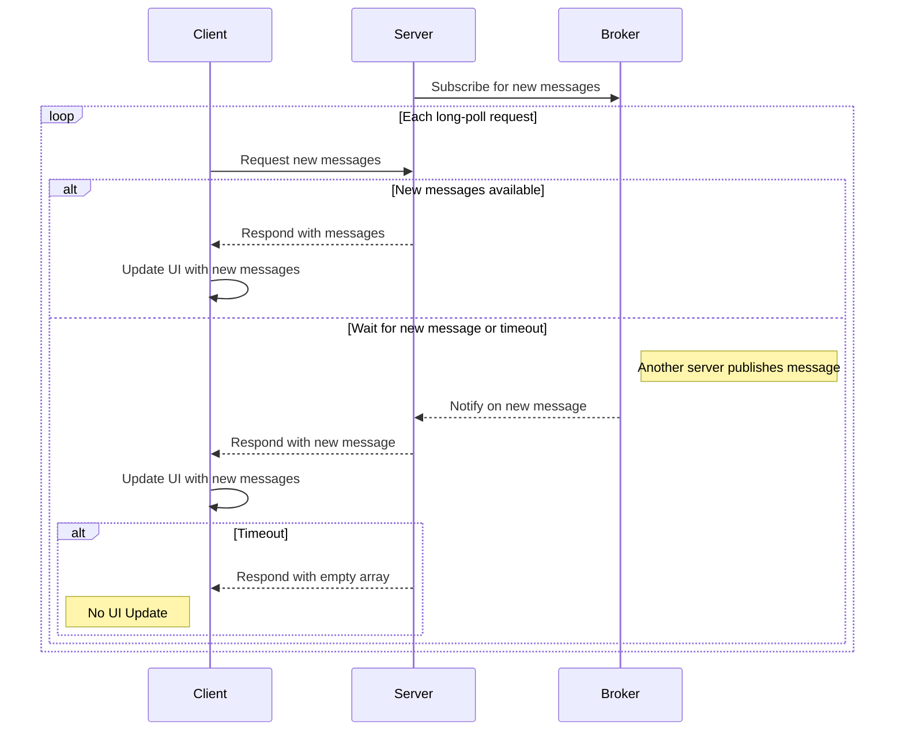
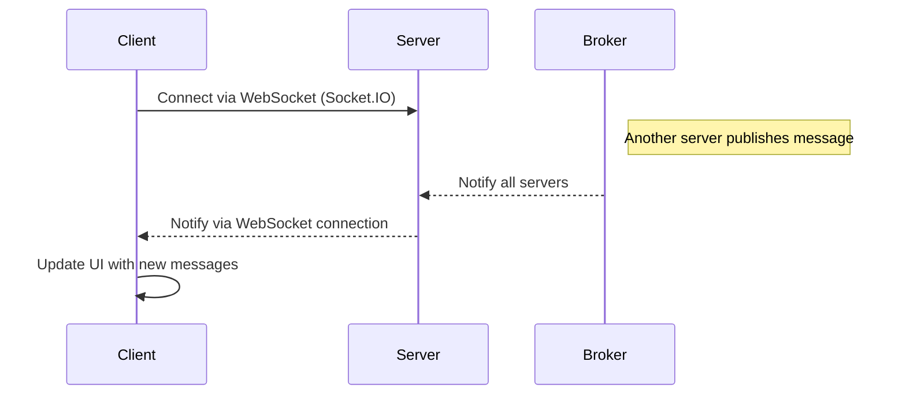

# realtime-patterns

A collection of patterns for implementing real-time client-server communication.

## Usage (for both examples)

- **Install dependencies:**

  ```sh
  npm install
  ```

  (This is a monorepo workspace. Install all dependencies at once from the root)

- **Start the server:**

  ```sh
  docker-compose up --build
  ```

  (Run this in the relevant example directory, e.g. `long-polling` or `web-sockets`)

- **Start the client:**

  ```sh
  cd long-polling/client   # or cd web-sockets/client
  npm run dev
  ```

- **Open the app:**
  Visit the URL shown in your terminal (typically http://localhost:5173) in your browser.

## Long-polling with Message Broker

### How It Works

- The client sends and receives messages via HTTP requests.
- The client opens a request to the server and waits for new messages or a timeout.
- The server responds immediately if there are new messages, or holds the request open until new data arrives or a timeout occurs.
- When a new message is posted, the server publishes it to a **message broker** (e.g., Redis Pub/Sub).
- All server instances subscribe to the broker and are notified instantly when new messages are available, rather than having to poll the database.
- The message broker does not store messages; messages are stored in the database.



### Pros

- **Scalable in load-balanced environments:** Works across multiple server instances or services thanks to the message broker.
- **Broad compatibility:** Works in all browsers and environments since it relies on standard HTTP requests.
- **Redis use:** Redis offers other benefits (e.g. caching) that could be very useful for scaling data-intensive workloads.

### Cons

- **Broker dependency:** Requires running and maintaining a message broker (e.g., Redis).
- **Inefficient resource usage:** Most polling requests may return no new data.
- **Not truly real-time:** Clients only receive updates at fixed intervals, introducing latency between data changes and client updates.
- **Memory usage:** Subscribers are kept in memory until notified or timed out.
- **Implementation complexity:** More moving parts than basic polling or single-node long-polling.

## WebSockets (Socket.IO) with Redis Adapter

### How It Works

- The client connects to the server using WebSockets (via Socket.IO).
- The server responds to real-time events and broadcasts messages to all connected clients instantly.
- When a new message is posted, the server publishes it to a **message broker** (Redis Pub/Sub) using the Socket.IO Redis adapter.
- All server instances subscribe to the broker and are notified instantly when new messages are available, ensuring real-time updates across all instances.
- The message broker does not store messages; messages are stored in memory or a database (not shown here).



### Pros

- **Truly real-time:** Clients receive updates instantly as soon as data changes.
- **Scalable in load-balanced environments:** Works across multiple server instances or services thanks to the Redis adapter (message broker).
- **Efficient resource usage:** No polling or holding HTTP requests open.
- **Broad compatibility:** Socket.IO works in all major browsers and handles fallback for older clients.
- **Redis use:** Redis offers other benefits (e.g. caching) that could be very useful for scaling data-intensive workloads.

### Cons

- **Broker dependency:** Requires running and maintaining a message broker (e.g., Redis).
- **WebSocket support:** Requires browsers and environments that support WebSockets (most modern browsers do).
- **Implementation complexity:** Socket management is much more complex than polling and opens the door to potential abuse of sockets.
