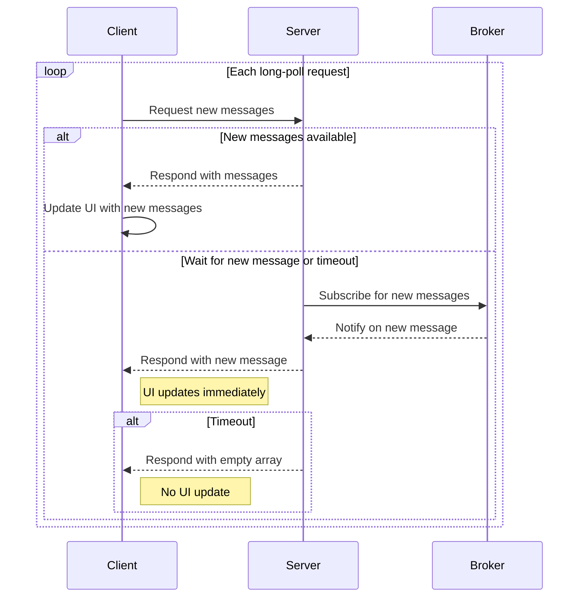

# Long-Polling with Message Broker

## How It Works

- The client sends and receives messages via HTTP requests.
- The client opens a request to the server and waits for new messages or a timeout.
- The server responds immediately if there are new messages, or holds the request open until new data arrives or a timeout occurs.
- When a new message is posted, the server publishes it to a **message broker** (e.g., Redis Pub/Sub).
- All server instances subscribe to the broker and are notified instantly when new messages are available, rather than having to poll the database.
- The message broker does not store messages; messages are stored in the database.

## Pros

- **Scalable in load-balanced environments:** Works across multiple server instances or services thanks to the message broker.
- **Broad compatibility:** Works in all browsers and environments since it relies on standard HTTP requests.
- **Redis use:** Redis offers other benefits (e.g. caching) that could be very useful for scaling data-intensive workloads.

## Cons

- **Broker dependency:** Requires running and maintaining a message broker (e.g., Redis).
- **Inefficient resource usage:** Most polling requests may return no new data.
- **Not truly real-time:** Clients only receive updates at fixed intervals, introducing latency between data changes and client updates.
- **Memory usage:** Subscribers are kept in memory until notified or timed out.
- **Implementation complexity:** More moving parts than basic polling or single-node long-polling.
