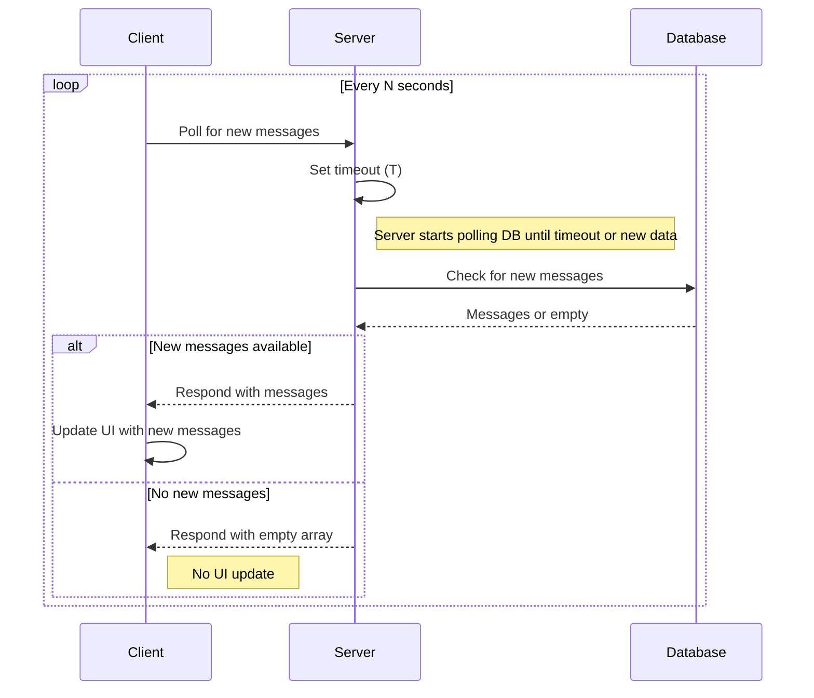

# Long-Polling

## How It Works

- The client sends and receives messages via HTTP requests.
- The client opens a request to the server and waits for new messages or a timeout.
- The server responds immediately if there are new messages, or holds the request open until new data becomes available or a timeout occurs.
- The server itself polls the database for new messages.
- Messages are stored in the database.

## Pros

- **Less initial time investment:** Requires no new architecture or technology.
- **Broad compatibility:** Works in all browsers and environments since it relies on standard HTTP requests.
- **Reduces database load compared to client polling:** Because the server manages polling for new data, the amount of database queries is tied to the number of server nodes, not the number of users.

## Cons

- **Inefficient resource usage:** Most polling requests may return no new data, leading to wasted bandwidth and unnecessary server processing.
- **Not truly real-time:** Clients only receive updates at fixed intervals, introducing latency between data changes and client updates.
- **Memory usage:** Subscribers are kept in memory until notified or timed out.
- **Scalability challenges:** Improving resource efficiency will increase coupling, while a loosely coupled design will consume more resources.
