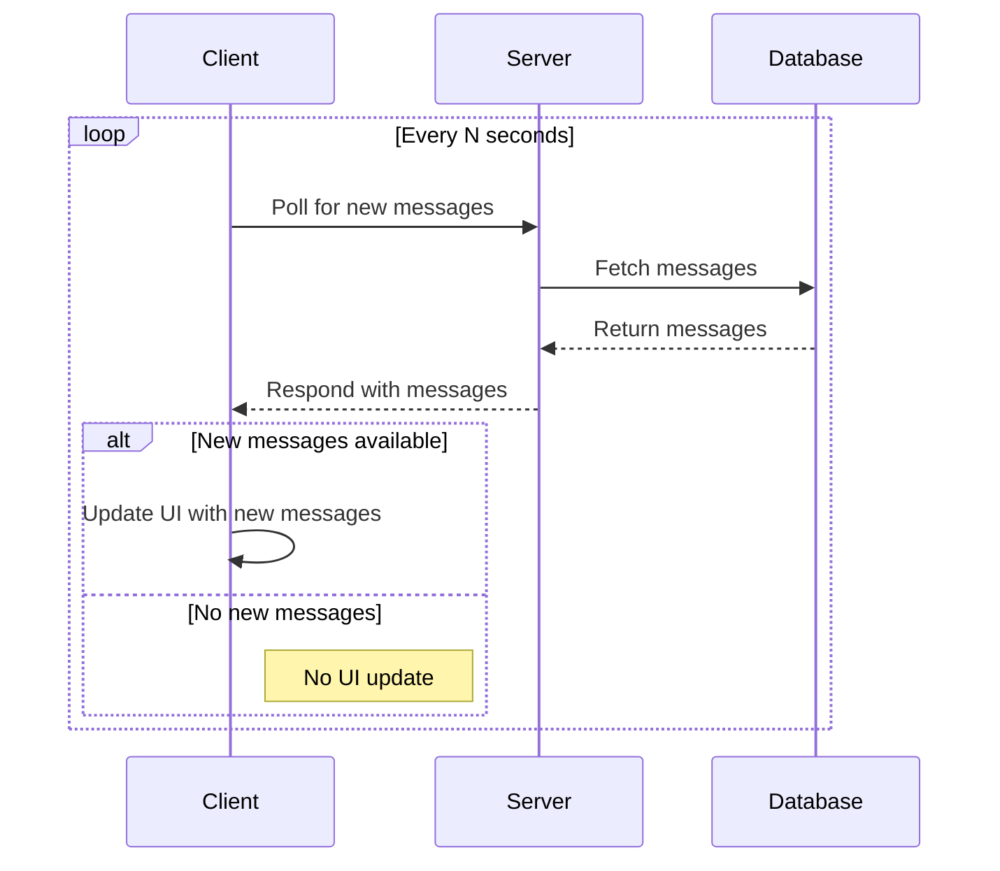

# Polling

## How It Works
- The client sends and receives messages via HTTP requests.
- The client polls the server every few seconds to fetch new messages.
- The server stores messages in the database.

## Pros
- **Easy to implement:** Requires minimal changes to existing client-server setups.
- **Broad compatibility:** Works in all browsers and environments since it relies on standard HTTP requests.
- **No special infrastructure needed:** Does not require WebSockets or persistent connections.

## Cons
- **Inefficient resource usage:** Most polling requests may return no new data, leading to wasted bandwidth and unnecessary server processing.
- **Not truly real-time:** Clients only receive updates at fixed intervals, introducing latency between data changes and client updates.
- **Scalability challenges:** High numbers of clients polling frequently can overload the server, and it’s difficult to balance different update frequencies for various types of data.
