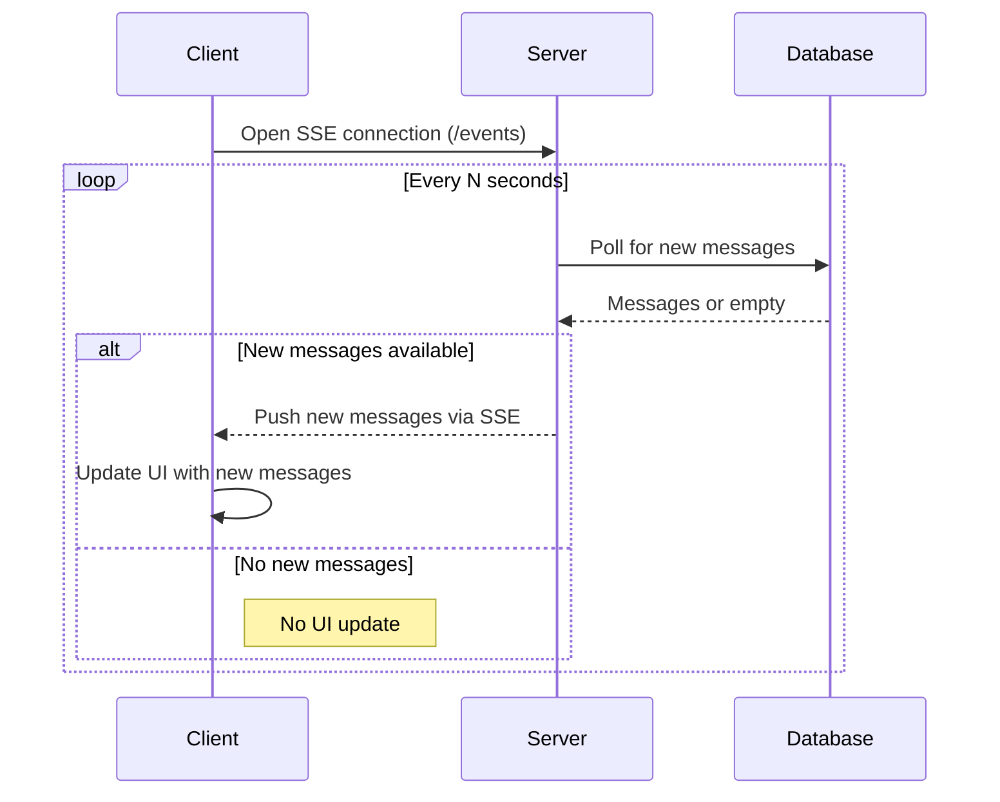

# Server-Sent Events (SSE) with Server-Side Polling

## How It Works

- The client establishes a persistent connection to the server using **Server-Sent Events (SSE)**.
- The server maintains a list of connected clients.
- The server polls the database for new messages at a fixed interval.
- When new messages are found, the server immediately pushes them to all connected SSE clients.
- Messages are stored in the database.

## Pros
- Real-time updates: Clients receive new messages as soon as the server detects them, without polling from the client.
- Efficient client connections: Each client maintains a single persistent HTTP connection for updates.
- Broad compatibility: SSE works in all modern browsers and is simple to implement on the client side.
- Reduces database load compared to client polling: Only the server polls the database, so query frequency is tied to the number of server nodes, not users.

## Cons
- Server polling overhead: The server still polls the database at intervals, which may introduce some latency and unnecessary queries if there are no new messages.
- Not truly instant: There is a small delay between when a message is added and when clients receive it, depending on the polling interval.
- Memory usage: The server must keep all SSE client connections open, which can be resource-intensive with many clients.
- Scalability challenges: In a multi-node environment, each server node must poll the database and manage its own client connections.