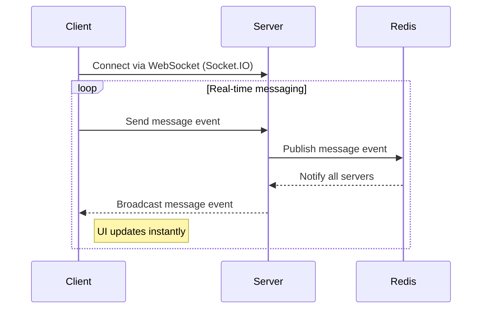

# WebSockets (Socket.IO) with Redis Adapter

## How It Works

- The client connects to the server using WebSockets (via Socket.IO).
- The server responds to real-time events and broadcasts messages to all connected clients instantly.
- When a new message is posted, the server publishes it to a **message broker** (Redis Pub/Sub) using the Socket.IO Redis adapter.
- All server instances subscribe to the broker and are notified instantly when new messages are available, ensuring real-time updates across all instances.
- The message broker does not store messages; messages are stored in memory or a database (not shown here).

## Pros

- **Truly real-time:** Clients receive updates instantly as soon as data changes.
- **Scalable in load-balanced environments:** Works across multiple server instances or services thanks to the Redis adapter.
- **Efficient resource usage:** No polling or holding HTTP requests open.
- **Broad compatibility:** Socket.IO works in all major browsers and handles fallback for older clients.
- **Redis use:** Redis offers other benefits (e.g. caching) that could be very useful for scaling data-intensive workloads.

## Cons

- **Broker dependency:** Requires running and maintaining a message broker (e.g., Redis).
- **WebSocket support:** Requires browsers and environments that support WebSockets (most modern browsers do).
- **Implementation complexity:** More moving parts than basic polling or single-node WebSocket setups.
- **State management:** In-memory message storage is not persistent; use a database for production.
